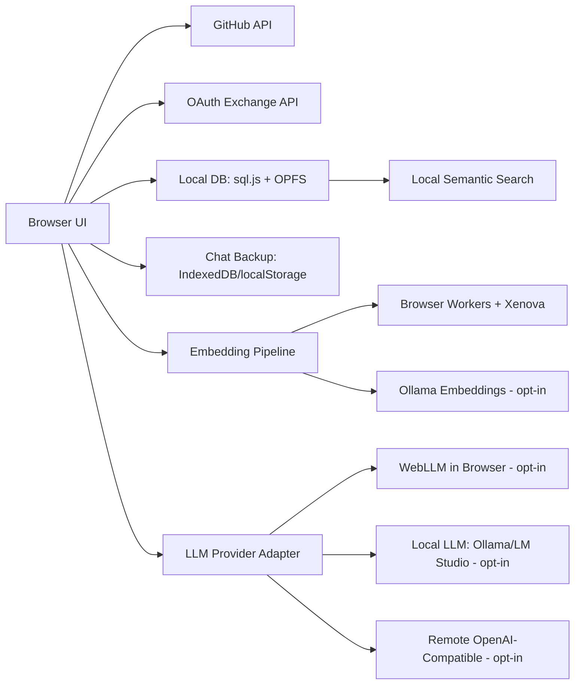
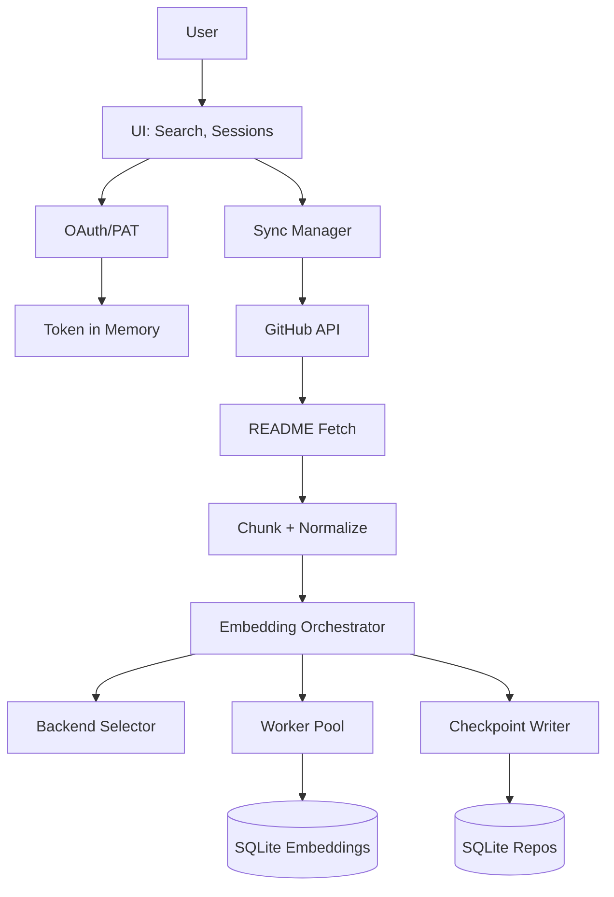
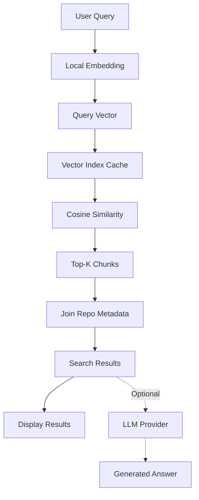

## Overview

GitStarRecall is a local-first web application that provides semantic search over GitHub starred repositories. The architecture is designed around privacy, performance, and browser compatibility.

## Architecture Diagram

### Trust Boundaries

The system operates across five distinct trust boundaries:

- **TB1: User Device / Browser Runtime** - All embeddings, repo content, and chat data lives here by default
- **TB2: GitHub API Boundary** - Only accessed for fetching stars and README content
- **TB3: External LLM Providers** - Optional, explicit opt-in only
- **TB4: Local LLM Providers** - localhost endpoints (Ollama/LM Studio), optional opt-in
- **TB5: Model Artifact Hosts** - CDN/HuggingFace for downloading embedding models and WebLLM assets

## Tech Stack

### Frontend

- **Framework**: Vite + React
- **Language**: TypeScript
- **Styling**: Tailwind CSS / Panda CSS
- **State Management**: TanStack Query for API caching and retries
- **Routing**: React Router
- **Markdown Rendering**: `react-markdown` + `rehype-sanitize`
- **Background Tasks**: Web Workers for embedding and indexing

### Client-Side Storage

- **Primary Storage**: SQLite WASM (`sql.js`) with OPFS (Origin Private File System)
- **Fallback Storage**: localStorage (when OPFS unavailable)
- **Memory-Only Mode**: When quota exceeded
- **Chat Backup**: IndexedDB with localStorage fallback
- **Cache**: In-memory LRU for hot queries

### Embeddings (Local-First)

- **Primary**: `@xenova/transformers`
- **Model**: `all-MiniLM-L6-v2` (384 dimensions)
- **Runtime Backend**:
  - Preferred: browser `webgpu` (when available)
  - Fallback: browser `wasm` CPU
- **Execution Policy**:
  - Micro-batch embedding requests (8-32, adaptive target 16)
  - Small worker pool (2 workers default, auto-downshift to 1 on pressure)
  - Checkpointed SQLite persistence (interval-based)
- **Optional Acceleration**: Ollama embeddings (localhost only, explicit opt-in)

### Vector Search

- **Method**: In-memory brute-force cosine similarity
- **Storage**: Float32 arrays stored as BLOB in SQLite
- **Normalization**: L2-normalization for stable cosine similarity
- **Caching**: Vector index cache rebuilt when embedding count changes

<Note>
  The current implementation uses brute-force similarity search rather than approximate nearest neighbors (ANN) like HNSW. This is because HNSW extensions for SQLite typically lack reliable browser WASM builds. The brute-force approach maintains acceptable performance for typical star counts (1k+ repos) while preserving local-first compatibility.
</Note>

### LLM Provider Abstraction

- **Remote Providers**: OpenAI, Anthropic, Gemini, DeepSeek, etc.
- **Local Providers**: Ollama and LM Studio (optional)
- **Browser Provider**: WebLLM (feature-flagged, opt-in download consent)
- **Streaming**: Full streaming response support with abort capability
- **Unified Interface**: Consistent request/response shape across all providers

#### WebLLM Model Policy

- **Primary**: `Llama-3.2-1B-Instruct-q4f16_1-MLC`
- **Fallback**: `SmolLM2-360M-Instruct-q4f16_1-MLC`
- **Additional Models**: Qwen2.5 1.5B, Gemma 2 2B, Hermes 3 Llama 3 3B, Llama 3.1 3B
- **Download Policy**: No model download starts before explicit user confirmation
- **Recommendation Logic**:
  - Mobile/weak devices → 360M model
  - Strong desktop → 1B model
  - Multi-signal scoring: WebGPU availability, CPU cores, memory, performance probe

## Data Flow

### High-Level Flow

1. User authenticates with GitHub OAuth or PAT
2. App fetches all starred repositories via GitHub REST API (paginated)
3. For each repo, fetch README and metadata
4. Chunk README + metadata into text segments
5. Embedding orchestrator schedules micro-batches to worker pool
6. Store embeddings and repo metadata in SQLite WASM
7. Checkpoint DB periodically and flush on completion
8. User query is embedded locally and run against local vector index
9. Top-K results shown immediately; optionally ask LLM for summary
10. Each query can open a new chat session or continue existing session
11. Star sync is user-initiated via `Fetch Stars`; search runs on current local index

### Indexing Flow Detail

### Search Flow Detail

## Core Components

### UI Layer

- Landing page (public, no login)
- OAuth callback handler
- Search interface with filters
- Results display with metadata
- Chat session manager
- Settings and provider configuration

### Chat Session Manager

- Per-query threads with message history
- Session list sorted by update time
- Ability to continue existing sessions
- Context window management
- Persistent storage in SQLite + IndexedDB backup

### GitHub Client

- Fetcher with rate-limit handling
- Automatic retry with exponential backoff
- Pagination support for starred repos
- README fetching with ETag/Last-Modified caching
- Error handling for missing/deleted/private repos

### Embedding Orchestrator

- Batching and queueing logic
- Worker pool scheduling
- Backend selection (WebGPU/WASM)
- Checkpoint coordination
- Progress tracking and UI updates (throttled)
- Large-library mode with priority ordering

### Indexing Workers

- Chunk embedding execution
- Model loading and caching
- Micro-batch processing
- Memory pressure detection
- Backend fallback handling

### Local Storage Layer

- SQLite WASM database
- OPFS persistence when available
- localStorage fallback
- Memory-only mode for quota exceeded
- Checksum-based diff sync
- Chat backup in IndexedDB

### Sync Engine

- Checksum-based repo diffing
- Incremental updates only
- Changed/new/removed star detection
- README change detection via ETag
- Resume capability for interrupted indexing

## Data Model

See [Data Storage](/advanced/data-storage) for detailed schema and implementation.

## Performance Strategy

### Current State (Implemented)

- Pagination with concurrency limits
- README fetching in batches with backoff
- Incremental sync using checksum diffs
- Progressive status UI
- Local-first indexing
- Micro-batch embeddings in worker pool
- Checkpointed SQLite persistence
- Backend selector (WebGPU preferred, WASM fallback)

### Performance Requirements

- **Time to first searchable chunks**: Improved materially over baseline
- **Retrieval quality**: Stable (same model, same normalization)
- **No UI freeze**: 1k+ stars without blocking main thread
- **Target**: Partial results within 120 seconds for 1k stars
- **Query response**: < 2 seconds after indexing complete

### Optimization Controls

#### Worker Pool

- Default: 2 workers
- Auto-downshift to 1 on memory pressure
- Configurable via `VITE_EMBEDDING_POOL_SIZE`

#### Batch Sizing

- Adaptive: 8-32 chunks per batch, target 16
- Configurable via `VITE_EMBEDDING_WORKER_BATCH_SIZE`
- Higher throughput vs. higher peak memory trade-off

#### Checkpointing

- Frequency: Every 256 embeddings or 3000ms
- Final flush on completion
- Configurable via `VITE_DB_CHECKPOINT_EVERY_EMBEDDINGS` and `VITE_DB_CHECKPOINT_EVERY_MS`
- Less frequent persistence vs. smaller crash-loss window

#### Backend Selection

- Preferred: `webgpu` (when available and healthy)
- Fallback: `wasm` CPU
- Configurable via `VITE_EMBEDDING_BACKEND_PREFERRED`
- WebGPU acceleration vs. compatibility variance

### Large-Library Mode

- Auto-enabled when repo count > 500 (configurable)
- Prioritizes high-value repos (stars + recency + README availability)
- Resume cursor in `index_meta` for interrupted jobs
- No automatic refresh on search; user triggers `Fetch Stars`

## Security Model

See the [PRD documentation](/advanced/architecture#prd) and threat modeling docs for complete security details.

### Key Security Principles

- **Local-first by default**: All data stays in browser unless explicitly opted in
- **No server persistence**: Unless user enables remote LLM
- **Strict CSP**: Content Security Policy with explicit allowlist
- **OAuth PKCE**: Secure OAuth flow, client secret on backend only
- **Token safety**: Stored in memory or encrypted WebCrypto storage
- **README sanitization**: `rehype-sanitize` prevents XSS
- **Minimal scopes**: GitHub token uses minimal required permissions

### What Stays Local

- GitHub star metadata
- README content and chunks
- Embeddings and vector index
- Chat sessions and message history
- User settings and preferences

### What Can Go Remote (Opt-in)

- Top-K context sent to LLM providers when answer generation is requested
- No GitHub tokens sent to LLM providers
- No embedding text sent externally (local-only processing)

## Cross-Platform Compatibility

### Browser-Only (Default Path)

- **Windows/macOS/Linux**: WebGPU when available, automatic WASM fallback
- **WebGPU Backend Mapping**:
  - Windows: Direct3D-based WebGPU
  - macOS: Metal-based WebGPU
  - Linux: Vulkan-based WebGPU
- **CPU Fallback**: Available on all platforms

### Optional Local Runtime

- **Ollama**: localhost embeddings and chat (opt-in)
- **LM Studio**: localhost chat with OpenAI-compatible API
- **CORS Note**: Local endpoints must allow browser access

## Implementation Phases

### Phase 1 - Foundations ✅

- Project scaffolding, UI shell
- GitHub authentication (OAuth + PAT)
- Stars fetching and pagination

### Phase 2 - Indexing ✅

- README fetcher and chunker
- Embedding generation in Web Worker
- SQLite WASM storage

### Phase 3 - Search ✅

- Query UI and retrieval
- Result ranking and filters
- Vector similarity search

### Phase 4 - LLM Integration ✅

- Provider abstraction
- Summaries and suggestions
- Chat sessions

### Phase 5 - Acceleration ✅

- Micro-batch worker API
- Checkpointed DB persistence
- Worker pool scheduling
- WebGPU preference with WASM fallback
- Cross-platform validation

## Related Documentation

- [Data Storage](/advanced/data-storage) - Database schema and storage implementation
- [Troubleshooting](/advanced/troubleshooting) - Common issues and solutions
- Technical PRD: `source/docs/tech-stack-architecture-security-prd.md`
- Security Review: `source/docs/security-review-stride.md`
- Threat Modeling: `source/docs/threat-modeling-stride.md`
